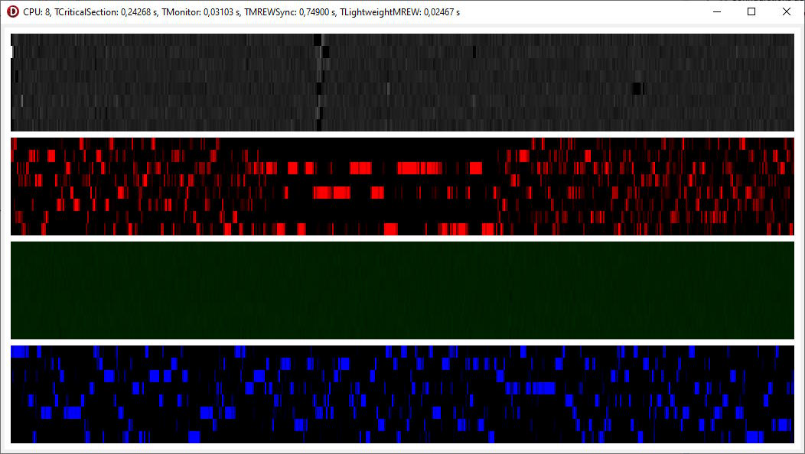

# Threads Locker 
 
En effectuant des recherches sur les performances de TCriticalSection, j'ai trouvé ces pages :
* [Delphitools.info](https://www.delphitools.info/2013/06/06/tmonitor-vs-trtlcriticalsection/)
* [Community.embarcadero.com/blogs](https://community.embarcadero.com/blogs/entry/monitoring-the-monitor-38952)

Ou les auteurs faisaient un comparatif entre TCriticalSection et TMonitor.

Etant a la recherche pour un programme utilisant massivement le multihreading le verrouillage le plus performants, j'ai voulu pousser un peu plus loin ce comparatif en y incluant les objets suivants :
* TCriticalSection.
* TMonitor.
* TMREWSync.
* TLightweightMREW.

## Voici le résultat visuel :

Pour toute suggestion d'amélioration de code, n'hésitez pas à me contacter.

## Modèle de license
Ces sources sont diffusé sous license [GNU GPL v3.0](https://www.gnu.org/licenses/quick-guide-gplv3.fr.html "License GNU GPL v3.0").
